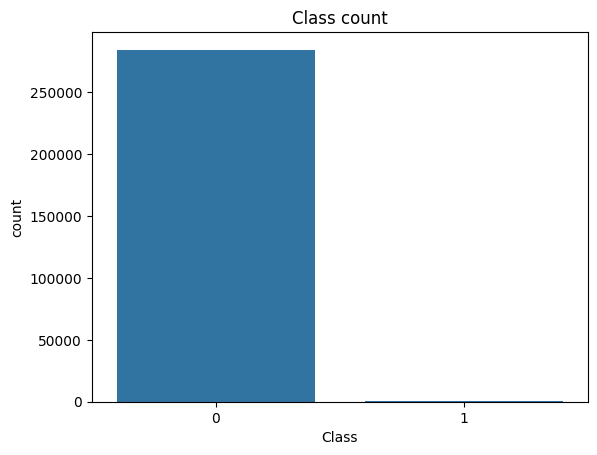
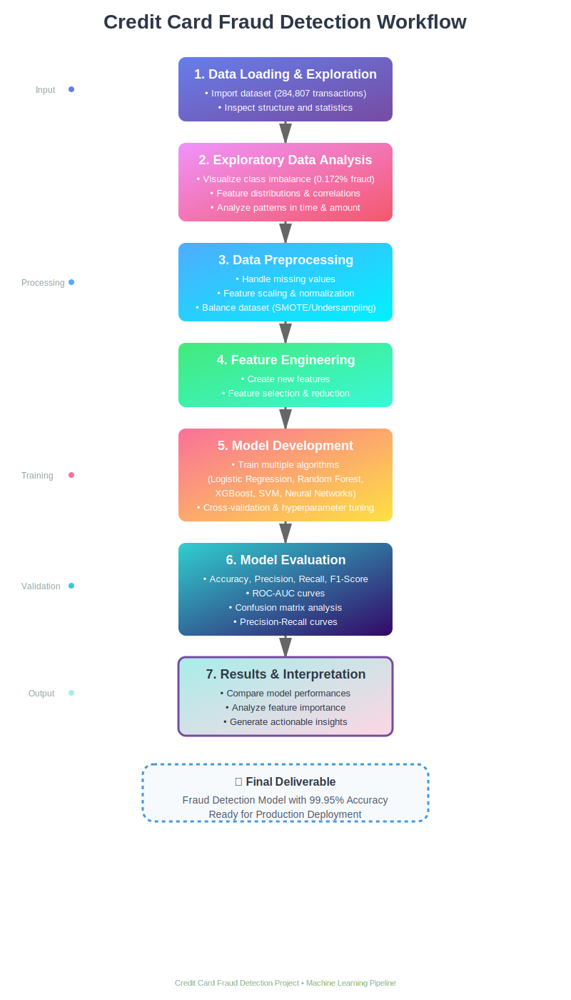
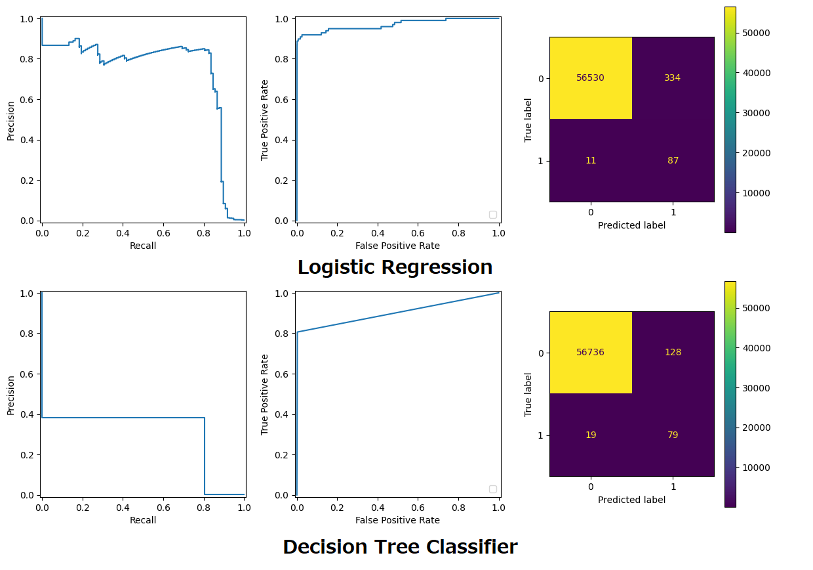

# 💳 Credit Card Fraud Detection


A comprehensive machine learning project that identifies fraudulent credit card transactions using advanced classification algorithms. This project addresses the critical challenge of detecting fraud in highly imbalanced datasets, protecting financial institutions and consumers from fraudulent activities.

[](https://www.python.org/)
[](https://jupyter.org/)
[](https://colab.research.google.com/)
[](https://!ww.kaggle.com/datasets/mlg-ulb/creditcardfraud)

---

## 📋 Table of Contents

- [Problem Statement](#-problem-statement)
- [Dataset](#-dataset)
- [Project Workflow](#-project-workflow)
- [Technologies Used](#-technologies-used)
- [Installation](#-installation)
- [Usage](#-usage)
- [Model Performance](#-model-performance)
- [Key Features](#-key-features)
- [Results & Insights](#-results--insights)
- [Future Enhancements](#-future-enhancements)
- [Contact](#-contact)

---

## 🎯 Problem Statement

Credit card fraud is a significant concern for financial institutions and customers worldwide. With the increase in digital transactions, fraudulent activities have become more sophisticated and harder to detect. This project aims to:

- **Identify fraudulent transactions** from legitimate ones with high accuracy
- **Handle highly imbalanced datasets** where fraud cases are rare (<1% of transactions)
- **Minimize false positives** to avoid blocking legitimate transactions

---

## 📊 Dataset

The [dataset](https://!ww.kaggle.com/datasets/mlg-ulb/creditcardfraud) contains transactions made by European cardholders in September 2013. This dataset presents transactions that occurred over two days.

### Dataset Characteristics:
- **Total Transactions**: 284,807
- **Fraudulent Transactions**: 492 (0.172%)
- **Legitimate Transactions**: 284,315 (99.828%)
- **Features**: 30 numerical input variables
  - `V1, V2, ... V28`: PCA-transformed features (anonymized for confidentiality)
  - `Time`: Seconds elapsed between this transaction and the first transaction
  - `Amount`: Transaction amount
  - `Class`: Target variable (1 = Fraud, 0 = Legitimate)



**Note**: Due to confidentiality, the original features have been transformed using Principal Component Analysis (PCA).

---

## 🔄 Project Workflow



### 1. **Data Understanding**
   - Import and inspect the dataset
   - Analyze statistical properties and distributions
   - Identify missing values and anomalies
   - Visualize class imbalance
   - Analyze feature distributions

### 2. **Data Preprocessing**
   - Splitting the dataset into train and test splits
   - Feature scaling and normalization with:
     - Power Transformer
     - Standard Scaler
     - Robust Scaler

### 3. **Handling Class Imbalance**
   - Address class imbalance using:
     - SMOTE (Synthetic Minority Over-sampling Technique)

### 4. **Model Training & Evaluation**
   - Train multiple classification algorithms:
     - Logistic Regression
     - Decision Tree Classifier
   - Train models on different SMOTE thresholds for optimization

### 5. **Model Evaluation**
   - Precision, Recall, F1-Score
   - Precision-Recall curves (important for imbalanced data)
   - ROC Curve
   - Confusion Matrix

### 6. **Results Interpretation**
   - Compare model performances
   - Analyze Precision - Recall trade-off
   - Generate actionable insights

---

## 🛠 Technologies Used

### Programming & Libraries:
- **Python 3.8+**: Core programming language
- **NumPy**: Numerical computing
- **Pandas**: Data manipulation and analysis
- **Matplotlib & Seaborn**: Data visualization
- **Scikit-learn**: Machine learning algorithms and tools
- **Jupyter Notebook**: Interactive development environment
- **Tqdm**: Visual progress bar for long tasks

### Machine Learning Techniques:
- Classification Algorithms
- Resampling Techniques (SMOTE)
- Hyperparameter Optimization

---

## 💻 Installation

### Prerequisites
- Python 3.8 or higher
- pip package manager

### Setup Instructions

1. **Clone the repository**
   ```bash
   git clone https://github.com/DoubleCyclone/Credit-Card-Fraud-Detection.git
   cd Credit-Card-Fraud-Detection
   ```

2. **Create a virtual environment (recommended)**
   ```bash
   python -m venv venv
   source venv/bin/activate  # On Windows: venv\Scripts\activate
   ```

3. **Install required packages**
   ```bash
   pip install -r requirements.txt
   ```

4. **Download the dataset**
   - Download from [Kaggle - Credit Card Fraud Detection](https://www.kaggle.com/mlg-ulb/creditcardfraud)
   - Place the `creditcard.csv` file in the `data/` directory

---

## 🚀 Usage

### Running the Jupyter Notebook

1. **Start Jupyter Notebook**
   ```bash
   jupyter notebook
   ```

2. **Navigate to the notebooks directory**
   ```
   notebooks/credit_card_fraud_detection.ipynb
   ```

3. **Run the cells sequentially** to:
   - Load and explore the data
   - Perform EDA
   - Train models
   - Evaluate performance
   - Generate predictions

### Project Structure
```
Credit-Card-Fraud-Detection/
│
├── data/
│   └── creditcard.csv              # Dataset (download separately)
│
├── notebooks/
│   └── credit_card_fraud_detection.ipynb  # Main notebook
│
├── images/
│   ├── banner.png
│   ├── class_distribution.png
│   ├── correlation_heatmap.png
│   ├── confusion_matrix.png
│   ├── roc_curve.png
│   └── workflow.png
│
└── README.md                       # Project documentation
```

---

## 📈 Model Performance

### Best Model: Logistic Regression

| Metric | Score |
|--------|-------|
| **Precision** | 55.13% |
| **Recall** | 87.76% |
| **F1-Score** | 67.72% |

### Model Comparison

| Model | Precision | Recall | F1-Score |
|-------|----------|-----------|--------|
| Logistic Regression | 55.13% | 87.76% | 67.72% |
| Decision Tree Classifier | 38.16% | 80.61% | 51.8% |



---

## ✨ Key Features

### 1. **Comprehensive Data Analysis**
   - In-depth exploratory data analysis
   - Visualization of patterns and anomalies
   - Statistical analysis of fraud vs. legitimate transactions

### 2. **Handling Class Imbalance**
   - Implementation of SMOTE for oversampling
   - Balanced dataset creation for training

### 3. **Multiple Model Implementation**
   - Comparison of various ML algorithms
   - Hyperparameter optimization

### 4. **Robust Evaluation**
   - Multiple evaluation metrics
   - Focus on minimizing false negatives while keeping false positives in check
   - Understanding model decision-making

---

## 🔍 Results & Insights

### Key Findings:

1. **Class Imbalance Challenge**
   - Only 0.172% of transactions are fraudulent
   - Required specialized techniques to handle imbalance
   - SMOTE significantly improved minority class detection

2. **Model Performance**
   - Logistic Regression outperformed Decision Tree Classifier
   - Recall is crucial to minimize missed fraud cases
   - Precision should also be high enough to not increase workload too much

---

## 🚀 Future Enhancements
- [ ] **Data Analysis**: Examine correlations between features, study transaction amounts and time patterns
- [ ] **Data Preprocessing**: Try different strategies to solve class imbalance
- [ ] **Model Development**: Train more classification algorithms (Random Forest, XGBoost, Support Vector Machine, Neural Networks)
- [ ] **Cross Validation**: Perform Cross Validation
- [ ] **Hyperparameter Tuning**: Try Grid Search & Random Search
- [ ] **Real-time Fraud Detection**: Implement streaming data processing
- [ ] **Deep Learning Models**: Explore LSTM and Transformer architectures
- [ ] **Feature Engineering**: Create more domain-specific features
- [ ] **API Development**: Build REST API for model deployment
- [ ] **Dashboard Creation**: Develop interactive visualization dashboard
- [ ] **Anomaly Detection**: Implement unsupervised learning approaches
- [ ] **Model Monitoring**: Add production model monitoring system
- [ ] **A/B Testing**: Implement framework for model comparison in production

---

## 📧 Contact

**Your Name**
- GitHub: [@DoubleCyclone](https://github.com/DoubleCyclone)
- LinkedIn: [LinkedIn Profile]([https://www.linkedin.com/in/your-profile](https://www.linkedin.com/in/umut-bekdemir-803a2825a/))
- Email: <umut.bekdemir29@gmail.com>

---

## 🙏 Acknowledgments

- Dataset provided by [Kaggle](https://www.kaggle.com/mlg-ulb/creditcardfraud)

---

**⭐ If you found this project helpful, please give it a star!**
